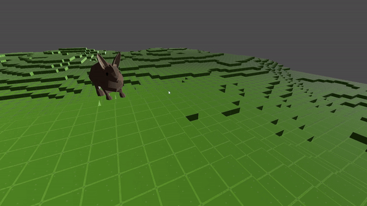
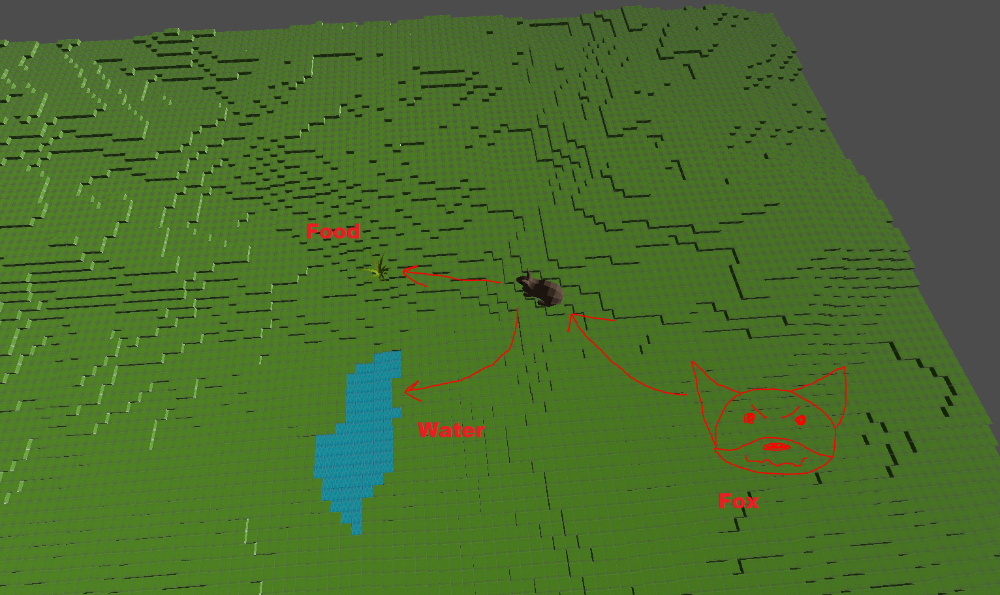
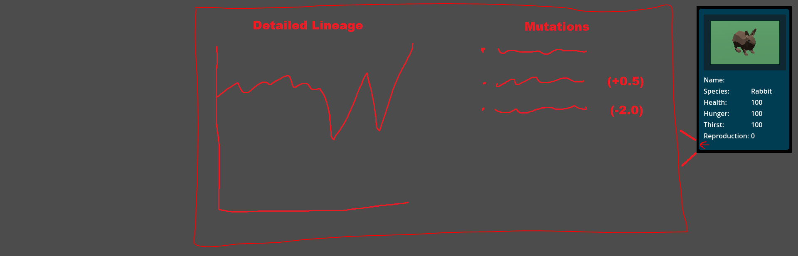
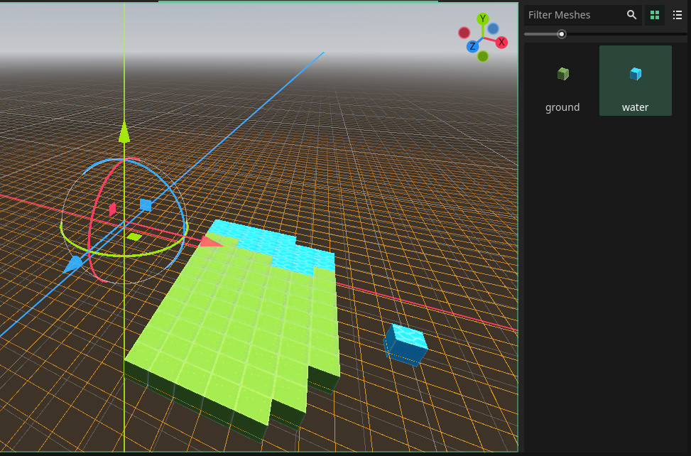
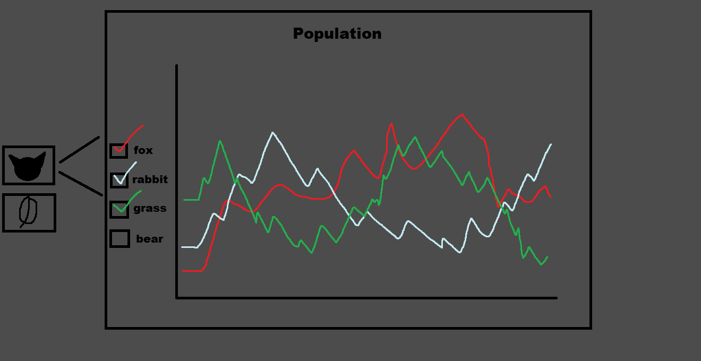

# Genesys Terrarium

Genesys Terrarium is a modular ecosystem simulation created in Godot.

Note: Most of the features written here are not implemented yet or are very basic, this is just to show the future development of the project.

## Key Features

### Dynamic Ecosystem Simulation

Simulate a comprehensive ecosystem with multiple interacting species. Including:

- Diverse plants and animals with distinct behaviors and needs
- Predator-prey relationships with state-driven interactions
- Environmental factors influencing species' behavior and survival

### Entity Inspection and Analysis

Interact with individual entities within the simulation to access detailed information:

- Changing status indicators (health, hunger, thirst, etc.)
- Performance metrics (speed, hunting efficiency)
- Generational data for tracking lineage

### Adaptive Behavior Systems

Entities inherit adaptive behaviors based on their current state and environmental conditions:

- Priority-based decision making (e.g., foraging vs. seeking safety)
- Dynamic response to threats and opportunities
- Basic resource management (energy conservation, risk assessment)

### Evolutionary Mechanics

Incorporates a genetic passdown system to simulate evolutionary processes:

- Mutation and inheritance systems for passing traits between generations
- Multi-generational tracking of genetic lineages
- Visualization tools for analyzing evolutionary trends over time

### Scenario Creation and Customization

Extensive customization options:

- Built-in map editor for creating diverse environments
- Procedural generation capabilities for randomized scenarios
- Fine-tuned control over initial conditions and simulation parameters
- Ability to add in new hazards or entities during runtime
- Fast-forward, pause, and other sim controls

Use these tools to create new scenarios, such as:
- "Putting 2 foxes against 100 rabbits"
- "Creating multiple small islands with limited resources"
- "Exploring the lifespan of one 'super' mutated rabbit"

### Data Analysis and Visualization

Access and view different types of data from each simulation:

- Real-time population tracking and species distribution
- Resource availability and consumption metrics
- Customizable graphs and charts for visualizing simulation data

## Cool Stuff

- Utilizes Godot's node system for managing large numbers of entities and their interactions
- Incorporates a robust event system (signals) for tracking and handling behavior state changes
- Features a modular design allowing for easy expansion and modification of species, behaviors, mutations and environmental factors

## Potential Applications / Future Work

- Incorporate reinforcement learning over different generations
- Prototype for a more specialized state-based environmental simulation
- Demonstration of AI and data visualization capabilities in an interactive, real-time environment

#
##
#### Name Explanation:
- Genesis = beginning
- Gene = genes in evolution 
- Sys = [computer] system
- Terrarium = simulation takes place in a terrarium
- :)
